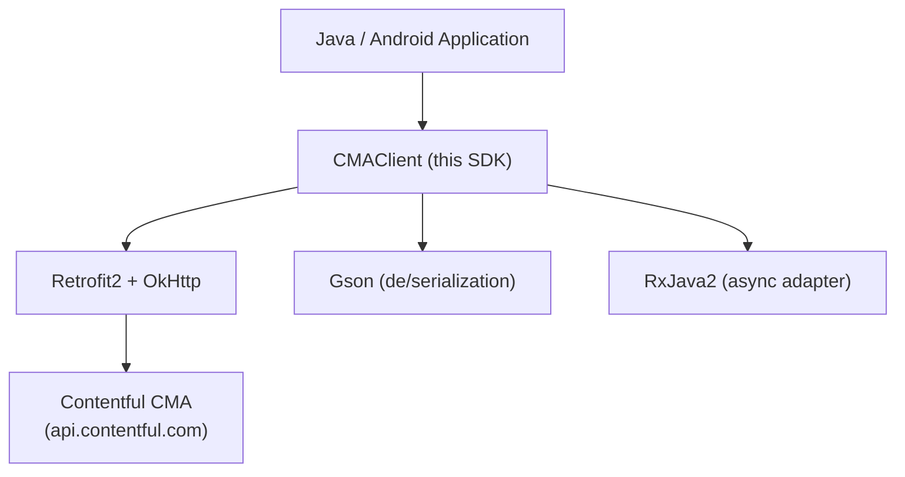

# Architecture

<!-- Generated by seed-golden-context | Last updated: 2026-05-11 -->

## Overview

`contentful-management.java` is the official Java SDK for Contentful's [Content Management API (CMA)](https://www.contentful.com/developers/docs/references/content-management-api/). It provides a strongly-typed, fluent Java client that wraps every CMA endpoint, supports both synchronous and asynchronous (RxJava2-backed) call patterns, and runs on Java 8+ including Android (API 21+).

## System Context



**Upstream:** Contentful Content Management API — authenticated via Personal Access Token (PAT) or OAuth token passed as `Authorization: Bearer <token>`.

**Downstream consumers:** Any Java or Android application that needs to programmatically create, read, update, or delete Contentful content, spaces, environments, or configuration resources.

## Internal Structure

| Directory / Package | Purpose |
|---|---|
| `src/main/java/com/contentful/java/cma/` | Core SDK: `CMAClient`, all `Module*` and `Service*` classes, interceptors, Gson adapters |
| `src/main/java/com/contentful/java/cma/model/` | All `CMA*` resource model POJOs (entries, assets, content types, etc.) |
| `src/main/java/com/contentful/java/cma/model/rich/` | Rich Text node hierarchy models |
| `src/main/java/com/contentful/java/cma/gson/` | Custom Gson serializers and deserializers for CMA-specific wire formats |
| `src/main/java/com/contentful/java/cma/interceptor/` | OkHttp interceptors: auth header, content-type, rate-limit, error, logging, user-agent |
| `src/main/resources/com/contentful/java/cma/build/` | Build-time generated `GeneratedBuildParameters.java` containing `PROJECT_VERSION` |
| `src/test/kotlin/com/contentful/java/cma/` | Unit tests (Kotlin + JUnit 4 + OkHttp MockWebServer) |
| `src/test/kotlin/com/contentful/java/cma/e2e/` | End-to-end integration tests (require live CMA credentials) |
| `src/test/resources/` | Mock JSON response fixtures for unit tests |
| `.devcontainer/` | Devcontainer config (Temurin JDK 8, multi-arch) — used by both local dev and CI |
| `.github/workflows/` | GitHub Actions CI: runs `./mvnw -B test` inside devcontainer |

## Module / Service Pattern

Each CMA resource type has two classes:

- **`Module<Resource>.java`** — public-facing API: validates arguments, wraps synchronous `service.*` calls, and exposes an `.async()` accessor returning a callback-based counterpart.
- **`Service<Resource>.java`** — Retrofit2 `@interface` defining the raw HTTP endpoints for that resource.

All modules extend `AbsModule<T>` which holds references to the Retrofit service, callback executor, and optionally pre-configured `spaceId` / `environmentId`.

```
CMAClient
  └── builds Retrofit instance (with interceptor chain)
  └── instantiates one Module per resource type
        └── Module delegates to Service (Retrofit interface)
              └── results wrapped via RxJava2 Observable
```

## Data Flow

1. **Client creation** — `CMAClient.Builder` assembles an OkHttp client with auth, user-agent, content-type, rate-limit, error, and logging interceptors, then builds a Retrofit instance backed by Gson + RxJava2.
2. **Synchronous call** — `client.entries().fetchAll(spaceId, environmentId)` → Module validates args → calls Retrofit service → blocks via `SynchronousExecutor` → returns typed result.
3. **Asynchronous call** — `client.entries().async().fetchAll(...)` → same service call → emits via RxJava2 Observable → marshalled onto the provided callback `Executor` → fires `CMACallback.onSuccess` / `onFailure`.
4. **Deserialization** — Gson with custom type adapters (`CMASystemDeserializer`, `EntrySerializer`, `FieldTypeAdapter`, etc.) converts CMA JSON wire format into `CMA*` POJOs.
5. **Error handling** — `ErrorInterceptor` converts non-2xx HTTP responses into `CMAHttpException`; `RateLimitInterceptor` surfaces rate-limit headers via `RateLimitsListener`.

## Key Dependencies

| Dependency | Why it's here |
|---|---|
| `retrofit2` (2.9.0) | Declarative HTTP client; supports interceptor chain and multiple call adapters. See [ADR-0002](./docs/ADRs/0002-retrofit2-as-http-client.md) |
| `retrofit2:adapter-rxjava2` | Enables async Observable-based responses bridging to CMACallback. See [ADR-0003](./docs/ADRs/0003-rxjava2-async-pattern.md) |
| `retrofit2:converter-gson` | JSON serialization; Gson chosen for Android compatibility and custom type adapter support |
| `com.google.code.gson` (2.8.9) | Custom de/serialization for CMA-specific types (rich text, snapshots, webhooks) |
| `io.reactivex.rxjava2:rxjava` (2.2.5) | Reactive foundation for async call pattern |
| `kotlin-stdlib` | Used in production code (minimal); tests are written entirely in Kotlin |
| `okhttp3` (test scope) | MockWebServer for unit tests; OkHttp itself is an optional runtime dep |
| `com.google.android:android` (optional) | Android API stubs — makes SDK compatible with Android API 21+ without requiring it |
| `junit` (4.13.1) | Test runner for unit tests |
| `org.jetbrains.kotlin:kotlin-test-junit` | Kotlin test assertions in unit test suite |

## Configuration

| Parameter | Purpose | Default |
|---|---|---|
| `accessToken` | CMA Personal Access Token or OAuth token (required) | — |
| `spaceId` | Pre-configure space ID so modules omit it per-call | `null` (pass per-call) |
| `environmentId` | Pre-configure environment ID | `null` (defaults to `master` for most endpoints) |
| `callbackExecutor` | `Executor` for async callback delivery | `Executors.newCachedThreadPool()` |
| `coreEndpoint` | Override CMA base URL (e.g., for proxying) | `https://api.contentful.com` |
| `uploadEndpoint` | Override upload endpoint | `https://upload.contentful.com` |
| `logLevel` | `Logger.Level` — `NONE`, `BASIC`, `HEADERS`, `FULL` | `NONE` |
| `logSensitiveData` | Whether to include auth headers in logs | `false` |
| `httpClient` | Custom `okhttp3.Call.Factory` | OkHttp if on classpath, else `HttpURLConnection` |

## Integration Points

### Upstream (this repo consumes)

- **Contentful CMA** (`api.contentful.com`) — all REST operations
- **Contentful Upload API** (`upload.contentful.com`) — binary asset uploads

### Downstream (consumes this repo)

- Any Java/Android application that needs to manage Contentful content programmatically
- Distributed via Maven Central (`com.contentful.java:cma-sdk`) and Sonatype snapshots

## Environment Scoping Rules (Sharp Edge)

The modules `apiKeys`, `environments`, `roles`, `spaceMemberships`, `uiExtensions`, `uploads`, and `webhooks` **do not support non-`master` environments**. If `CMAClient` is configured with a non-master `environmentId`, these modules throw `CMANotWithEnvironmentsException`. Always create a separate client without an `environmentId` for these modules.
