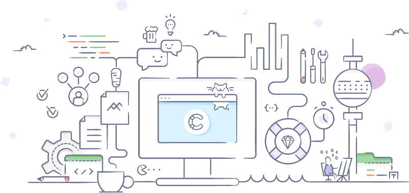

<p align="center">
  <br/>
  <a href="https://www.contentful.com/slack/">
    
  </a>
  &nbsp;
  <a href="https://www.contentfulcommunity.com/">
    
  </a>
</p>

contentful-management.java - Contentful Java Management SDK
===========================================================

[](https://travis-ci.org/contentful/contentful-management.java/builds#) 
[](https://codecov.io/gh/contentful/contentful-management.java)

> Java SDK for [Content Management API](https://www.contentful.com/developers/docs/references/content-management-api/). It helps in editing and creating content stored in Contentful with Java applications.


What is Contentful?
-------------------
[Contentful](https://www.contentful.com) provides a content infrastructure for digital teams to power content in websites, apps, and devices. Contentful, unlike any other CMS, is built to integrate with the modern software stack. It offers a central hub for structured content, powerful management and delivery APIs, and a customizable web app that enable developers and content creators to ship digital products faster.

<details open>
  <summary>Table of contents</summary>
  <!-- TOC -->

- [Core Features](#core-fProGuardeatures)
- [Getting Started](#getting-started)
  - [Setup](#setup)
  - [Client Creation](#client-creation)
  - [First Request](#first-request)
- [Usage](#usage)
  - [Modules](#modules)
  - [Calls in Parralel](#calls-in-parallel)
  - [Environment Configuration](#environment-configuration)
  - [Default HTTP Client](#default-http-client)
  - [ProGuard](#proguard)
  - [Pre-Releases](#pre-releases)
- [Documentation](#documentation)
- [License](#license)
- [Reaching Contentful](#reaching-contentful)
  - [Bugs and Feature Requests](#bugs-and-feature-requests)
  - [Sharing Confidential Information](#sharing-confidential-information)
  - [Getting involved](#getting-involved)
- [Code of Conduct](#code-of-conduct)
  <!-- /TOC -->
</details>

Core Features
=============

- Content manipulation through [Content Management API](https://www.contentful.com/developers/docs/references/content-management-api/).
- Supported Endpoints
  * [ApiKeys](https://www.contentful.com/developers/docs/references/content-management-api/#/reference/api-keys)
  * [Assets](https://www.contentful.com/developers/docs/references/content-management-api/#/reference/assets)
  * [ContentTypes](https://www.contentful.com/developers/docs/references/content-management-api/#/reference/content-types)
  * [EditorInterface](https://www.contentful.com/developers/docs/references/content-management-api/#/reference/editor-interface)
  * [Entries](https://www.contentful.com/developers/docs/references/content-management-api/#/reference/entries)
  * [Environments](https://www.contentful.com/developers/docs/references/content-management-api/#/reference/environments)
  * [Locales](https://www.contentful.com/developers/docs/references/content-management-api/#/reference/locales)
  * [Organizations](https://www.contentful.com/developers/docs/references/content-management-api/#/reference/organizations)
  * [PersonalAccessTokens](https://www.contentful.com/developers/docs/references/content-management-api/#/reference/personal-access-tokens)
  * [PreviewApiKeys](https://www.contentful.com/developers/docs/references/content-management-api/#/reference/api-keys/preview-api-keys-collection)
  * [Roles](https://www.contentful.com/developers/docs/references/content-management-api/#/reference/roles)
  * [SpaceMemberships](https://www.contentful.com/developers/docs/references/content-management-api/#/reference/space-memberships)
  * [Spaces](https://www.contentful.com/developers/docs/references/content-management-api/#/reference/spaces)
  * [UiExtensions](https://www.contentful.com/developers/docs/references/content-management-api/#/reference/ui-extensions)
  * [Uploads](https://www.contentful.com/developers/docs/references/content-management-api/#/reference/uploads)
  * [Users](https://www.contentful.com/developers/docs/references/content-management-api/#/reference/users)
  * [Webhooks](https://www.contentful.com/developers/docs/references/content-management-api/#/reference/webhooks)

Getting Started
===============

Setup
-----

Install the Contentful dependency:

* _Maven_
```xml
<dependency>
  <groupId>com.contentful.java</groupId>
  <artifactId>cma-sdk</artifactId>
  <version>3.3.1</version>
</dependency>
```

* _Gradle_
```groovy
compile 'com.contentful.java:cma-sdk:3.3.1'
```

This SDK requires Java 8 (or higher version).

Client Creation
---------------

The `CMAClient` manages all interactions with the _Content Management API_.

```java
final CMAClient client =
    new CMAClient
        .Builder()
        .setAccessToken("<access_token>")
        .build();
```

The _Access Token_ can easily be obtained through the [management API documentation](https://www.contentful.com/developers/docs/references/authentication/#getting-a-personal-access-token).

First Request
-------------

By selecting a [Module](#modules), say `.entries()` and using its manipulator methods, like `.fetchAll()`, changes can be applied to the underlying resources. Resources can be fetched as following:

```java
final CMAArray<CMAEntry> array =
    client
        .entries()
        .fetchAll();
```

Usage
=====


Modules
-------

A client performs various operations on different types of _Resources_ (such as _Assets_, _Content Types_, _Entries_, _Spaces_, etc). Every type of Resource is represented by a _Module_ in the `CMAClient` class, for example:

```java
client.spaces() // returns the Spaces Module
client.entries() // returns the Entries Module
client.assets() // returns the Assets Module
…
```

Calls in Parallel
-----------------

Each Module contains a set of methods that perform various operations on the specified Resource type. Every method has a corresponding asynchronous extension which can be accessed through the `async()` method of the Module, for example the following synchronous call

```java
final CMAArray<CMASpace> array =
    client
        .spaces()
        .fetchAll(
	    "space_id",
	    "environment_id"
	);
```

can be expressed by this asynchronous call:

```java
final CMAArray<CMASpace> array =
    client
        .spaces()
        .async()
        .fetchAll(
	    "space_id",
	    "environment_id",
	    new CMACallback<CMAArray<CMASpace>>() {
  @Override protected void onSuccess(CMAArray<CMASpace> result) {
    // success
  }

  @Override protected void onFailure(RetrofitError retrofitError) {
    // failure
  }
});
```

> Note: The default `CMACallback` has an empty `onFailure()` implementation. If failures are of interest, overriding this method is mandatory.

> Note: [The CMA documentation][docs] offers more code snippets for all Modules.


Environment Configuration
-------------------------

Instead of repeating the _Space_ and _Environment _ids with every call like so

```java
final CMAArray<CMAEntry> array =
    client
        .entries()
        .fetchAll(
            "space_id",
            "environment_id",
        );
```

the client can be configured to always use the same values:

```java
final CMAClient client =
    new CMAClient
        .Builder()
        .setAccessToken("<access_token>")
        .setSpaceId("<space_id>")
        .setEnvironmentId("<environment_id>")
        .build();
```

This changes the parameters Modules are using: 

```java
final CMAArray<CMAEntry> array =
    client
        .entries()
        .fetchAll();
```

*Words of warning*

The Modules `apiKeys`, `environments`, `roles`, `spaceMemberships`, `uiExtensions`, `uploads`, and `webhooks`, do not support Environments different to `master`. If the above configuration is used with these Modules, they throw an `exception`. Creation of a new client without specifying an Environment id is needed:

```
final CMAArray<CMAApiKey> array = 
    client
        .apiKeys()
        .fetchAll(
	   "spaceid"
	);
```

Default HTTP Client
-------------------

The SDK uses [Retrofit][2] as a REST client, which detects [OkHttp][3] in the classpath and uses it if available, or else it falls back to the default `HttpURLConnection`.

The recommended approach would be to add [OkHttp][3] as a dependency to your project, but that is completely optional.

It is possible to specify a custom client to be used, refer to the [official documentation][4] for instructions.


RichText Hierarchy
------------------

In order to create and update rich text fields, the following rule set is enforced from Contentful:

1. A Document cannot be nested inside a Document.
1. A Document can only contain Paragraphs, Lists, or Texts.
1. Paragraphs can contain Paragraphs or Text and Link nodes.
1. Links have to be inside of Paragraphs.
1. A List has to be inside of a Document.
1. A ListItem has to contain at least one Paragraph.

For supported and tested combinations of Nodes, please take a look at the [Rich Text End to End tests](src/test/kotlin/com/contentful/java/cma/e2e/RichTextE2E.kt), those will be kept updated over time and should give an overview on what is possible.

Pre-releases
------------

Snapshots of the development version are available through

* [Sonatype's `snapshots` repository][snap]

```groovy
maven { url 'https://oss.sonatype.org/content/repositories/snapshots' }
compile 'com.contentful.java:cma-sdk:3.3.1-SNAPSHOT'
```

* [jitpack.io](https://jitpack.io/#contentful/contentful-management.java/master-SNAPSHOT):

```groovy
maven { url 'https://jitpack.io' }
compile 'com.github.contentful:contentful.java:cma-sdk-3.3.1-SNAPSHOT'
```

Documentation
=============

See
* [JavaDoc](https://contentful.github.io/contentful-management.java/) 
* [API documentation](https://www.contentful.com/developers/documentation/content-management-api/)

License
=======

> Copyright (C) 2019 Contentful GmbH. See [LICENSE.txt](LICENSE.txt) for further details.


Reaching Contentful
===================

Questions
---------

* Use the community forum: [](https://support.contentful.com/)
* Use the community slack channel: [](https://www.contentful.com/slack/)

Bugs and Feature Requests
-------------------------

* File an issue here [](https://github.com/contentful/contentful-management.java/issues/new).

Sharing Confidential Information
--------------------------------

* File a support ticket at our Contentful Customer Support: [](https://www.contentful.com/support/)

Getting involved
----------------

[](http://makeapullrequest.com)

Code of Conduct
===============

Contentful wants to provide a safe, inclusive, welcoming, and harassment-free space and experience for all participants, regardless of gender identity and expression, sexual orientation, disability, physical appearance, socioeconomic status, body size, ethnicity, nationality, level of experience, age, religion (or lack thereof), or other identity markers.

[Full Code of Conduct](https://github.com/contentful-developer-relations/community-code-of-conduct).

 [1]: https://www.contentful.com
 [2]: https://square.github.io/retrofit
 [3]: https://square.github.io/okhttp
 [4]: https://contentful.github.io/contentful-management.java
 [5]: LICENSE.txt
 [snap]: https://oss.sonatype.org/content/repositories/snapshots/
 [docs]: https://www.contentful.com/developers/docs/references/content-management-api/
